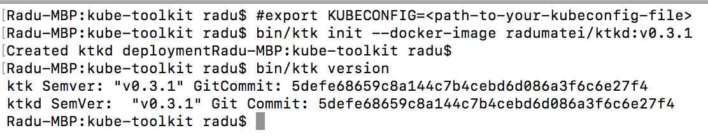
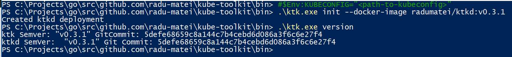

kube-toolkit  - https://radu-matei.com/blog/kube-toolkit/
==========================================================

> Image from [@ashleymcnamara](https://github.com/ashleymcnamara/gophers)'s gopher artwork - [license](https://github.com/ashleymcnamara/gophers/blob/master/LICENSE)

About
-----

If you ever used [Helm](https://github.com/kubernetes/helm) or [Draft](https://github.com/azure/draft), you know they are very cool command-line tools that connect to a Kubernetes cluster, more specifically to a server-side componend (Tiller in the case of Helm, Draftd for Draft) without exposing ports on the Internet, and allow you to interact with your cluster through gRPC-based services.

This repo aims to help you build similar services by allowing you to start from a pre-configured tool

Architecture
------------

[`kube-toolkit`](https://github.com/radu-matei/kube-toolkit) has two major components:

- `ktk` (short for Kubernetes ToolKit) - client that you install locally

- `ktkd` (short for Kuberentes ToolKit Daemon) - server-side component that is deployed on your Kubernetes cluster 

The `kube-toolkit` client (`ktk`) interacts with the server-side component (`ktkd`) using the Kubernetes API to create authenticated tunnels back to the cluster, using gRPC as the underlying communication protocol. The server runs as a pod in Kubernetes, and since it is only a starting point for future tools, it only knows how to return its version, and showcases how to stream data back to the client.

In order to communicate with the cluster you need to pass the `kubeconfig` file, and the tool will start a tunnel to the cluster for each command you execute, then will tear it down so there are no open connections to the cluster when no command is executed.

> Please note that there are still lots of things left to add, such as SSL, RBAC support or state management - you are more than welcome to contribute in any way to the project!

Getting started
---------------

First, you need to clone the repo and `make ktk`.

> You can also [check the releases page for a binary for your OS - however, it is not guaranteed that you will find an up-to-date version](https://github.com/radu-matei/kube-toolkit/releases).

Next, you need to set an environment variable that points to your kube config file, then excecute the `init` function:

On Linux / macOS:

`export KUBECONFIG=<path-to-kubeconfig-file>`

`ktk init --docker-image radumatei/ktkd`:

On Windows:

`$Env:KUBECONFIG=<path-to-kubeconfig-file>`

`ktk.exe init --docker-image radumatei/ktkd`:

This will automatically create a deployment in your Kubernetes cluster with the `ktkd` server, and you can interact with any command you might have created.

Next step
----------

Now that you understood how all things fit together, you need to: 

- write some commands (step by step docs on how to do it soon - basically mirror what the `version` does)

- `make ktkd-linux` - this will build the `ktkd` Linux binary

- `docker build -t <your-username>/ktkd` - create container image with the new `ktkd-linux` binary

- `docker push <your-username>/ktkd` - push the image to Docker Hub

- `ktk reset` - delete the current `ktkd` deployment from your cluster

- `ktk init --docker-image <your-username>/ktkd` - deploy the new version of the `ktkd` server

- have fun!

Disclaimer
----------
This is not an official Microsoft project, and all credits go to the awesome people building Helm and Draft, on which kube-toolkit is based.

Contributing
------------

Any idea (here, on Twitter - @Matei_Radu), issue or pull request is highly appreciated. Contribution guidelines will follow once there is a structure to this project.
