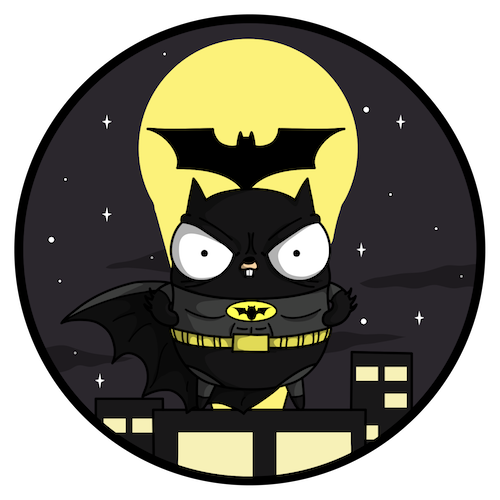
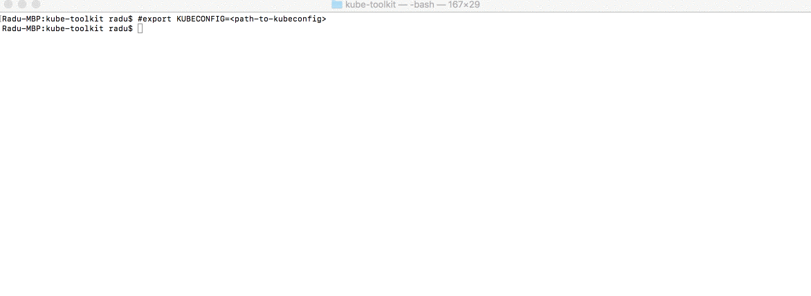
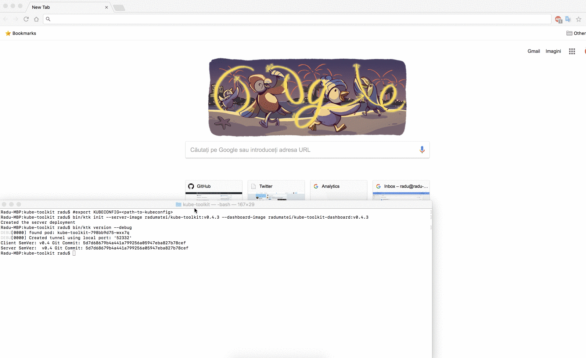

kube-toolkit 
============



> Image from [@ashleymcnamara](https://github.com/ashleymcnamara/gophers)'s gopher artwork - [license](https://github.com/ashleymcnamara/gophers/blob/master/LICENSE)


About
-----
If you ever used `kubectl`, [Helm](https://github.com/kubernetes/helm), [Draft](https://github.com/azure/draft) or even the Kubernetes UI Dashboard and wanted yourself to create a tool for Kubernetes, you've come to the right place.

This is a toolkit for creating gRPC-based CLI and web tools for Kubernetes, and it should be used as a starting point in new awesome tools for Kubernetes, written in Go.

Here's a quick introduction of `kube-toolkit` to [SIG-Apps](https://github.com/kubernetes/community/tree/master/sig-apps):

[](https://youtu.be/wLwzcVzxpls?t=1m56s)


Architecture
-------------

- `client` - local CLI client that deploys the `server` and the `dashboard` to your Kubernetes cluster and interacts through gRPC with the server via a Kuberentes tunnels to `localhost`
- `server` - gRPC server that is deployed on your Kubernetes cluster and responds to requests coming from the clients
- `dashboard` - web application that communicates with the `server` through a [gRPC-gateway](https://github.com/grpc-ecosystem/grpc-gateway)

The `kube-toolkit` client interacts with the server-side component using the Kubernetes API to create authenticated tunnels back to the cluster, using gRPC as the underlying communication protocol. The `server` and `dashboard` components run in the same Kubernetes pod.

In order to communicate with the cluster you need to pass the `kubeconfig` file, and the tool will start a tunnel to the cluster for each command you execute, then will tear it down so there are no open connections to the cluster when no command is executed.


Getting started
----------------

> Before you get started, make sure to:
> - have Go installed (everything has been tested with Golang 1.9.2)
> - install [the protobuf compiler](https://github.com/google/protobuf) and [the Go bingings](https://github.com/golang/protobuf)
> - install [the gRPC-gateway proxy and swagger generators](https://github.com/grpc-ecosystem/grpc-gateway)

> You can find the prerequisites for building the project in a container in [prerequisites.sh](prerequisites.sh), or in the [CircleCI configuration file](/.circleci/config.yml)

Assuming you have your environment correctly setup, you can clone this repository (recursively, as there is a git submodule, more on this later), we can simple `make client`.

> If you take a look at the the first line of the Makefile, you can change the name of the built binaries - by default, the names are `ktk` for the client, `ktkd` for the server and `gateway` for the gateway and dashboard -the `ktk` name comes from `kube-toolkit`.

> If you change a binary name, make sure to also change it in the associated Dockerfile!

 Next, you need to setup an environment variable that points to your Kubernetes config file:
On Linux / macOS:
`export KUBECONFIG=<path-to-kubeconfig-file>`

On Windows:
`$Env:KUBECONFIG=<path-to-kubeconfig-file>`

Then, you need to execute the `init` command - the client can automatically deploy to your cluster the server-side and web components, using the Kuberentes Go Client - you need to specify the Docker image for the gRPC server - `server-image` and for the web dashboard - `dashboard-image`. At the moment of writing this article, the latest pushed version is [`v0.4.3`](https://github.com/radu-matei/kube-toolkit/releases/tag/v0.4.3). If you use the client from that revision and the Docker images below, things should work properly.

`bin/ktk init --server-image radumatei/kube-toolkit:latest --dashboard-image radumatei/kube-toolkit-dashboard:v0.4.3`

> If you want to clone the `master` branch, there is no guarantee that things will work correctly!

After the deployment, you should be able to execute commands:

`bin/ktk version --debug`

Let's see it in action:



Now let's see the dashboard! Before we can access the dashboard, we need to create a tunnel to the cluster - much like in the case of the Kubnernetes UI dashboard, we first need a proxy to the cluster:

`bin/ktk proxy --port 8081 --debug`



> Once you terminate the proxy command, the tunnel will close and you won't have access to the dashboard anymore


Once you are done with the tool, want to delete the server or just want to `init` with a newer version, there's a `reset` command that will delete the deployment from the cluster:

`bin/ktk reset`


Extending `kube-toolkit`
------------------------

On its own, `kube-toolkit` only represents the starting point for your next awesome Kubernetes tool - this means you need to extend it with your own functionality, and while this is not a complete tutorial (yet) on how to do it, here's the basics:

- first, you need to update the `.proto` definition of your gRPC service. The definition is in [`pkg/rpc/rpc.proto`](pkg/rpc/rpc.proto) this is the interesting part:

```proto
service GRPC {
	rpc GetVersion(google.protobuf.Empty) returns (Version){
		option (google.api.http) = {
            get: "/api/version"
          };
	}
	rpc ServerStream(google.protobuf.Empty) returns(stream Message){}
}
```

The main service name is `GRPC`, and we will look at the `GetVersion` method we explored from the CLI and the web dashboard. Essentially, the `option` part comes from [`gRPC-gateway`](https://github.com/grpc-ecosystem/grpc-gateway) and maps the `GetVersion` gRPC method to a REST api GET method, on `/api/version`.

We will use the `.proto` file to automatically generate the gRPC client, server, swagger definition and HTTP gateway that will serve HTTP clients to the gRPC server - if you take a look at the Makefile at the `rpc` target:

```
protoc 
	--go_out=plugins=grpc:pkg/rpc pkg/rpc/*.proto 
	--grpc-gateway_out=logtostderr=true:pkg/rpc 
	--swagger_out=logtostderr=true:gateway/web
```

The `protoc` compiler will generate the Go gRPC client and server, as well as the gRPC-gateway (HTTP web server implementation that handles requests to REST API paths and maps them to gRPC requests) and the swagger definition that we will use to automatically generate a TypeScript client to use in the web application:


```
cd gateway/web && \
rm -rf src/generated-client && mkdir src/generated-client && \
    
docker run --rm -v ${PWD}/gateway/web:/local swaggerapi/swagger-codegen-cli generate && \
    -i /local/rpc.swagger.json && \    
    -l typescript-angular && \
    -c /local/swagger.config.json && \
    -o /local/src/generated-client

```

For this task we use the container-packaged `swagger-codegen-cli` and output the client in the web `dashboard/web/src/generated-client` directory.

Note that the swagger generator creates everything we need to start calling the API from our web application right away, including classes for the gRPC messages defined in the `.proto`. So everytime you add methods to your gRPC server, you automatically get the server, client and web APIs required to start using it.


> Please note that while it is possible to [create streaming methods and use HTTP](https://github.com/grpc-ecosystem/grpc-gateway/blob/master/examples/examplepb/stream.proto), the most straightforward way of using the gRPC gateway is to have the non-streaming methods mapped in your REST API.

- after you update the `.proto` and generate the code, you have to implement the desired server functionality (that is in [`server.go`](https://github.com/radu-matei/kube-toolkit/blob/master/pkg/server/server.go) - note that if you add methods in the `.proto` and don't implement them, the server will fail at compile-time), add the client functionality (in [`client.go`](https://github.com/radu-matei/kube-toolkit/blob/master/pkg/client/client.go)) and implement a new CLI command that uses it - if you base on the `version` and `stream` commands, you should understand how everything fits together.

> The client is simply a Cobra-based CLI.

- now for the dashboard - this is an Angular 4 application, and all you need to do is add a new component, register its route and module and use the auto-generated API client to implement the functionality.

> Step-by-step tutorial on how to extend the project coming soon.

At this point, you need to:

- `make client`

- `docker build -t <your-username>/kube-toolkit .` - create container image with new server

- `docker build -t <your-username>/kube-toolkit-dashboard -f Dockerfile.gateway .` - create container image with new dashboard

- `docker push <server, dashboard>`

- `bin/ktk reset` and `bin/ktk init <using-new-images>`


> The process is rather complicated at the moment and could be drastically improve by Draft


Work in Progress
----------------

- [state management using `etcd`](https://github.com/radu-matei/kube-toolkit/issues/19) - work to start soon
- [RBAC](https://github.com/radu-matei/kube-toolkit/issues/10) and [SSL](https://github.com/radu-matei/kube-toolkit/issues/7) support - help wanted
- [testing](https://github.com/radu-matei/kube-toolkit/issues/6) and [documentation](https://github.com/radu-matei/kube-toolkit/issues/11) - help wanted, good first issues

Contributing
------------

Any idea (here, on Twitter - @Matei_Radu), issue or pull request is highly appreciated. Contribution guidelines will follow once there is a structure to this project.

Disclaimer
----------
This is not an official Microsoft project, and it is based on the works of people building Helm, Draft, gRPC-gateway, Kubernetes and many others.
